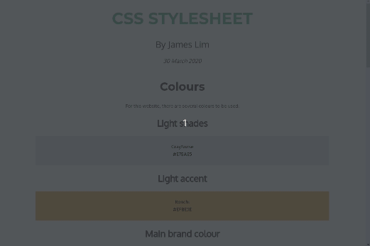

# CSS Stylesheet

A basic CSS stylesheet I created as practice utilising a pleasant colour palate and font selection.

## Colours
For this website, there are several colours to be used:

### Light shades
GrayNurse

\#E7EAE5

### Light accent
Ronchi

\#EFBE5E

### Main brand colour
Silver Tree

\#6DB892

### Dark accent
Copperfield

\#DF816E

### Dark shades
Soya Bean

\#594F49

## Font stylings
### Montserrat - Headings

### Oxygen - Subheadings

### Hind Madurai

### Fira Mono

## Text-stylings

### H1: Headings

font-size: 2.5rem

font-weight: bold

color: #594F49

### H2: Subheadings

font-size: 2rem

font-weight: bold

color: #594F49

### H3: Aside Headings

font-size: 1.75rem

font-weight: bold

color: #594F49

### P: Paragraph text

font-size: 1.1rem

font-weight: normal

color: #594F49

### TITLE: MAIN TITLE

font-size: 3.5rem

color: #6DB892

text-transform: uppercase

font-weight: 700

### Author: Me

font-size: 2rem

font-weight: 400

color: #594F49

### Date: Today

font-size: 1.25rem

font-weight: 500

color: #594F49
